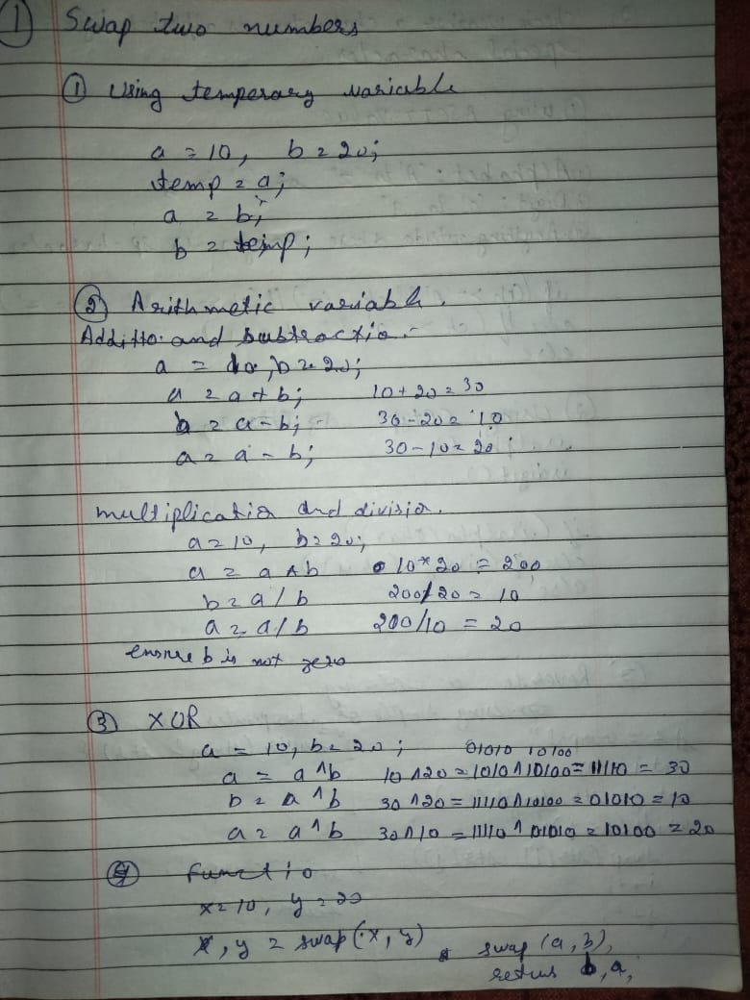

# Swapping Two Numbers in C++

This folder contains multiple C++ programs that demonstrate different ways to swap two numbers. Each method highlights a unique technique for swapping values, useful for understanding basic programming concepts.

---

## 📜 Methods Covered
1. **Using a Temporary Variable**
2. **Without Using a Temporary Variable (Arithmetic Operators)**
3. **Using Bitwise XOR**
4. **Using Functions**
5. **Using Pointers**

---

## 📂 Folder Structure
- `01_using_temp_variable.cpp`: Swapping using a temporary variable.
- `02_using_arithmetic_op.cpp`: Swapping without a temporary variable (using arithmetic operations).
- `03_using_XOR.cpp`: Swapping using the XOR operator.
- `04_using_pair.cpp`: Swapping using a pair.
- `05_using_pointer.cpp`: Swapping using pointers.

---

## 📷 Dry Code Example
Below is a photo of the dry code explanation for swapping two numbers

---

## 🤝 Contributions
Feel free to contribute by adding more ways to swap numbers or optimizing existing solutions. Fork the repo and create a pull request. 🎉

---

## 📧 Contact
For any queries, feel free to reach out:

GitHub: Gurpal-saghi-9
Email: Gurusaghi324.com
